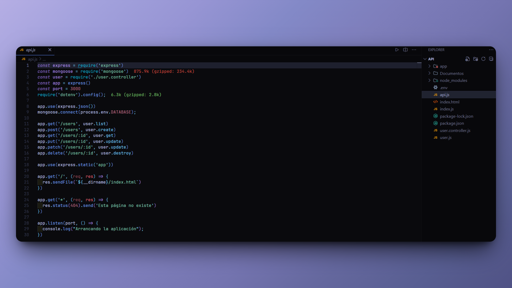

<h1 align="center">User Registration App 👥</h1>

<p align="left">
  <a href="README_ES.md" target="_blank">
    Ver README en Español
  </a>
</p>

<p>This is a simple backend application developed to add users to a MongoDB database. It was created as a learning project to reinforce skills in <b>Node.js</b>, <b>Express</b>, <b>MongoDB</b>, and <b>JavaScript</b>.</p>
<hr>

<h1 align="center">Technologies Used</h1>
<div align="center">
  
  
  
  
</div>
<hr>

<h1 align="center">Project Goals</h1>
<ol>
  <li>Strengthen knowledge of Express by building a basic REST API.</li>
  <li>Learn how to interact with MongoDB using CRUD operations.</li>
  <li>Gain practical experience with the backend development flow using JavaScript.</li>
</ol>
<hr>

<h1 align="center">Main Features</h1>
<ul>
  <li>Add user information, including:</li>
  <ul>
    <li>First Name</li>
    <li>Last Name</li>
  </ul>
  <li>MongoDB integration to store and manage user data.</li>
  <li>Modular code structure: routes, controllers, and configurations are separated for clarity.</li>
</ul>
<hr>

<h1 align="center">Skills Acquired</h1>
<ul>
  <li>Connecting to a MongoDB database using Mongoose.</li>
  <li>Designing a RESTful API using Express.</li>
  <li>Handling errors and performing basic request validation.</li>
  <li>Implementing full CRUD operations.</li>
</ul>
<hr>

<h1 align="center">Installation</h1>

1. Clone the repository:

   ```sh
   git clone https://github.com/JordanMedinaOrtiz/add-users-nodejs.git
   cd add-users-nodejs
   ```

2. Install dependencies:

   ```sh
   npm install
   ```

3. Create and configure your environment:

   - Create a `.env` file in the root directory.
   - Add the following variable:
     ```sh
     DATABASE=your_mongodb_connection_string
     ```

4. Start the server:

   ```sh
   node api.js
   ```

5. Test the API:

   - Use Postman or Insomnia to send requests and add users to the database.

<hr>

<p>This project provided hands-on experience with backend development and working with NoSQL databases. Although simple, it lays the groundwork for more advanced applications in the future.</p>

