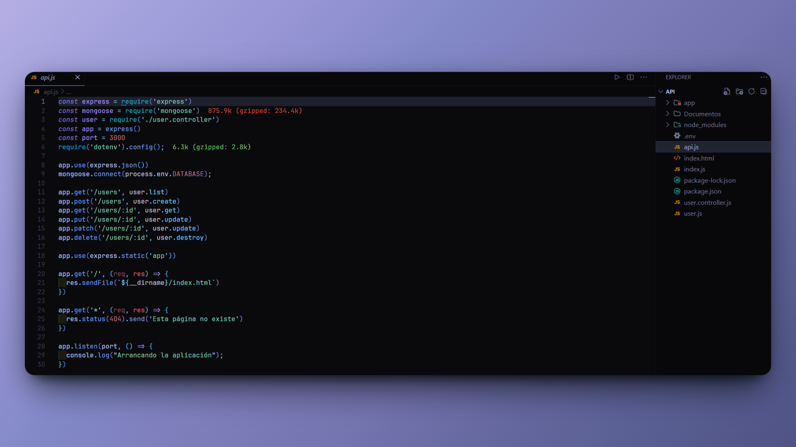

<h1 align="center">Agregar Usuarios 👥</h1>

<p align="left">
  <a href="README.md" target="_blank">
    View README in English
  </a>
</p>

<p>Este proyecto es una aplicación backend sencilla diseñada para agregar usuarios a una base de datos MongoDB. Fue desarrollado como una práctica para reforzar habilidades en <b>Node.js</b>, <b>Express</b>, <b>MongoDB</b> y <b>JavaScript</b>.</p>
<hr>

<h1 align="center">Tecnologías Utilizadas</h1>
<div align="center">
  
  
  
  
</div>
<hr>

<h1 align="center">Objetivo</h1>
<ol>
  <li>Consolidar conocimientos en el uso de Express para construir una API básica.</li>
  <li>Aprender a interactuar con MongoDB utilizando operaciones CRUD.</li>
  <li>Ganar experiencia práctica en un flujo completo de desarrollo backend con JavaScript.</li>
</ol>
<hr>

<h1 align="center">Características Principales</h1>
<ul>
  <li>Permite agregar información sobre usuarios, incluyendo:</li>
  <ul>
    <li>Nombre</li>
    <li>Apellidos</li>
  </ul>
  <li>Conexión con una base de datos MongoDB para almacenar y gestionar los datos.</li>
  <li>Estructura modular del código, separando rutas, controladores y configuraciones.</li>
</ul>
<hr>

<h1 align="center">Aprendizajes Adquiridos</h1>
<ul>
  <li>Configurar y conectar una base de datos MongoDB utilizando Mongoose.</li>
  <li>Diseñar y estructurar una API RESTful con Express.</li>
  <li>Manejar errores y validaciones básicas en las solicitudes HTTP.</li>
  <li>Crear un flujo completo de operaciones CRUD para gestionar datos.</li>
</ul>
<hr>

<h1 align="center">Instalación</h1>

1. Clona este repositorio:

   ```sh
   git clone https://github.com/JordanMedinaOrtiz/add-users-nodejs.git
   cd add-users-nodejs
   ```

2. Instala las dependencias:

   ```sh
   npm install
   ```

3. Configura el entorno:

   - Crea un archivo `.env` en la raíz del proyecto.
   - Agrega la siguiente variable:
     ```sh
     DATABASE=tu_ruta_de_conexión_a_mongodb
     ```

4. Inicia el servidor:

   ```sh
   node api.js
   ```

5. Prueba la API:

   - Usa herramientas como Postman o Insomnia para probar los endpoints y agregar usuarios.

<hr>

<p>Este proyecto fue un paso importante para afianzar habilidades en desarrollo backend y en el manejo de bases de datos NoSQL. Aunque su implementación es sencilla, representa un pilar fundamental para proyectos más complejos en el futuro.</p>

